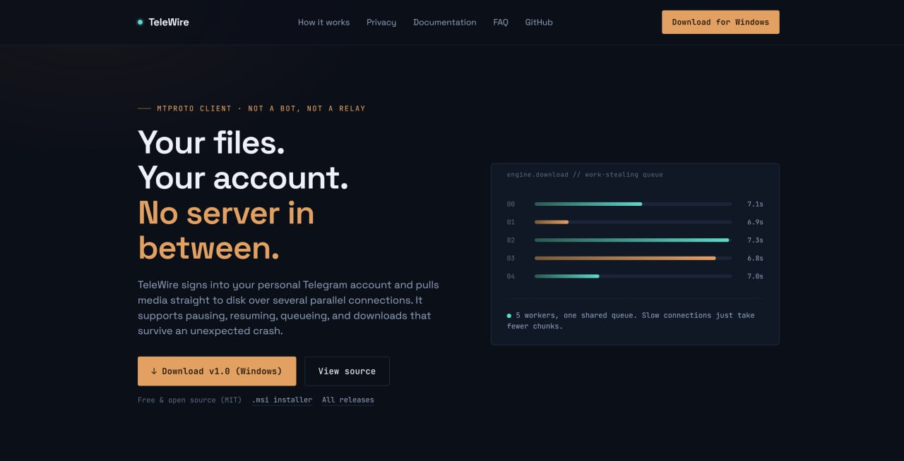

### Launch Day: Telewire App Goes Live
Today marks a significant milestone for my project, Telewire. After about a week of development, the app is now live and available to the public through GitHub Releases. Alongside the app's launch, I've also created a dedicated landing page to serve as a central hub for information and updates.

The landing page, which can be found at [https://yaserzarifi.github.io/telewire/index.html](https://yaserzarifi.github.io/telewire/index.html), is designed to provide an easy-to-access introduction to Telewire, its features, and its purpose.

In addition to making the app and its landing page publicly accessible, I've also taken steps to enhance its visibility online. I've configured the landing page in Google Console to improve its search engine optimization (SEO) and answer engine optimization (AEO). These efforts aim to increase the app's discoverability and reach a broader audience.

*It's a moment of excitement and anticipation as I share Telewire with the world, hoping it will find its users and provide them with value.* 

> "The best way to get started is to quit talking and begin doing." 

This launch is a testament to the power of taking action and turning ideas into reality. I'm looking forward

