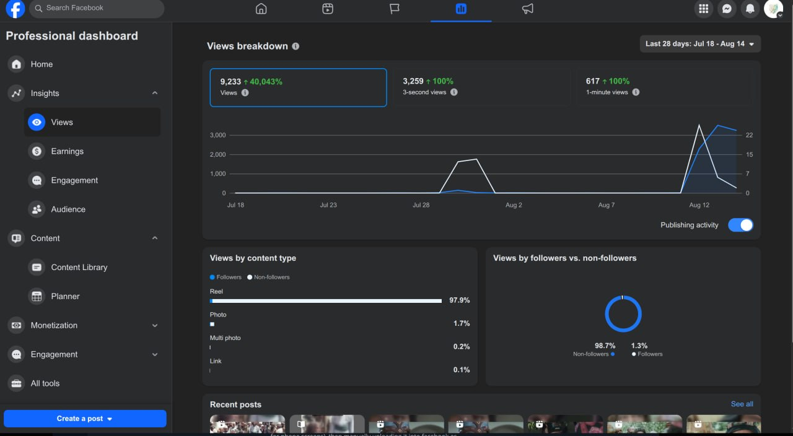

Also, it is a couple of days. I have been working on Facebook reels, and it has resulted beyond my expectation. During this, I found that posting on Facebook via Graph API massively reduces the distribution (about 0), unlike YouTube. So I decided to make a video editor and splitter via Python and the FFmpeg library to make 5-minute reels (vertical videos fit for phone screens), then manually upload it into Facebook as reels, and you can see the result for a first and newborn Facebook page.

